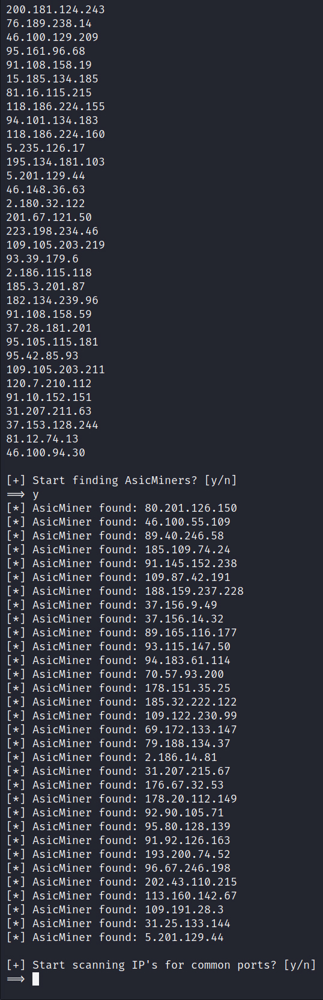

# BruteMiner

Bruteforce tool for AsicMiner and Awesome Miner

## Usage

To run script properly, you need to modify `main.py` (insert your Shodan and Censys API keys).


### Modes

1. Find IP, check common ports, find AsicMiners/AwesomeMiners, brute admin account on 80 port;
2. Ports scanner;
3. Brute usernames on 80 port;
4. Brute pass for specific user on 80 port;
5. Brute admin account on 80 port;
6. Find AsicMiners/AwesomeMiners in file with IP.

```sh
# Run first mode:
python3 -m 1

# Run first mode with socks5 proxy (file proxy.txt must exist):
python3 -m 1 -p
```

## Screenshots



